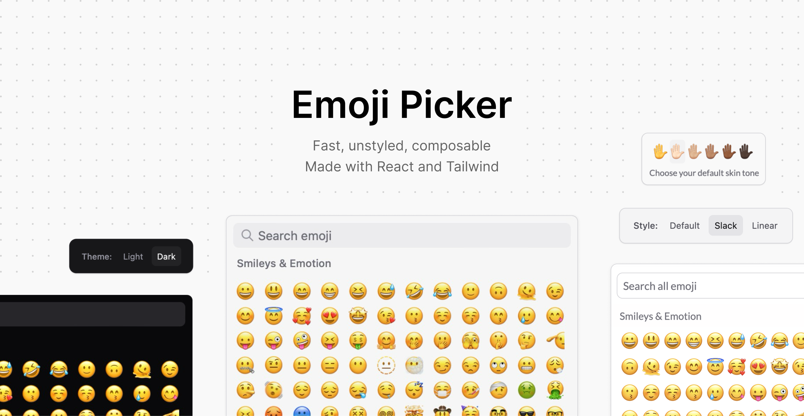

<div align="center">
  <h1>Emoji Picker</h1>
  <p>A composable React emoji picker component with Tailwind styling</p>
</div>

<div align="center">
  
[](https://www.npmjs.com/package/@ferrucc-io/emoji-picker)
[](https://www.npmjs.com/package/@ferrucc-io/emoji-picker)
[](https://github.com/ferrucc-io/emojicn/blob/main/LICENSE)
  
</div>

<div align="center">
  
</div>

<div align="center">
  <h3>
    <a href="https://emoji.ferrucc.io">Live Demo</a>
  </h3>
</div>

## Installation

To use this component your project must be using React and Tailwind.

To install the component:

```bash
bun add @ferrucc-io/emoji-picker
# or
yarn add @ferrucc-io/emoji-picker
# or
npm i @ferrucc-io/emoji-picker
# or
pnpm add @ferrucc-io/emoji-picker
```

Then in your project you can use the component like this:

```tsx
<EmojiPicker onEmojiSelect={handleEmojiSelect}>
  <EmojiPicker.Header>
    <EmojiPicker.Input placeholder="Search emoji" />
  </EmojiPicker.Header>
  <EmojiPicker.Group>
    <EmojiPicker.List />
  </EmojiPicker.Group>
</EmojiPicker>
```

Finally, import the component styles in your Tailwind configuration:

```tsx
// If you're using Tailwind v4.x
// In your CSS file containing your tailwind configuration
// Add this line:
@source "../node_modules/@ferrucc-io/emoji-picker";

// If you're using Tailwind v3.x
// In your tailwind.config.ts
"content": [
  // Keep the existing content array
  // Add this line:
  "./node_modules/@ferrucc-io/emoji-picker/dist/**/*.{js,jsx,ts,tsx}",
],
```

## Features

- 🎨 **Unstyled & Composable**: Built with Tailwind CSS. Every component is minimally styled by default and fully customizable.
- ⚡️ **Fast & Lightweight**: Virtualized list for smooth scrolling. Only renders emojis in view.
- 🎯 **Accessible**: Full keyboard navigation support. ARIA labels and proper semantic markup.
- 🌈 **Dominant Color Hover**: Built-in dominant color hover for supported emojis.


## Default Style
```tsx
<EmojiPicker onEmojiSelect={handleEmojiSelect}>
  <EmojiPicker.Header>
    <EmojiPicker.Input placeholder="Search emoji" />
  </EmojiPicker.Header>
  <EmojiPicker.Group>
    <EmojiPicker.List />
  </EmojiPicker.Group>
</EmojiPicker>
```

### Props & Customization

The base component accepts several props for customization:

```tsx
interface EmojiPickerProps {
  emojisPerRow?: number;      // Number of emojis per row
  emojiSize?: number;         // Size of each emoji in pixels
  containerHeight?: number;    // Height of the emoji container
  maxUnicodeVersion?: number; // Maximum Unicode version to include in the list of emojis (we default to 15.0)
  onEmojiSelect?: (emoji: string) => void; // Callback when emoji is selected
}
```

## Examples

The main idea behind the component is to be able to support as many different styles as possible. The first version we made supports building a picker that looks like the ones in Slack and Linear.

In the future it would be great to support more styles like the ones in Discord, Whatsapp, Notion etc.


### Linear Style
```tsx
<EmojiPicker>
  <EmojiPicker.Header className="pb-0">
    <EmojiPicker.Input placeholder="Search emoji" />
  </EmojiPicker.Header>
  <EmojiPicker.Group>
    <EmojiPicker.List hideStickyHeader />
  </EmojiPicker.Group>
</EmojiPicker>
```

### Slack Style
```tsx
<EmojiPicker 
  className="font-['Lato'] w-[300px] border-none"
  emojisPerRow={9}
  emojiSize={36}
>
  <EmojiPicker.Header>
    <EmojiPicker.Input 
      placeholder="Search all emoji" 
      hideIcon
    />
  </EmojiPicker.Header>
  <EmojiPicker.Group>
    <EmojiPicker.List containerHeight={320} />          
  </EmojiPicker.Group>
  <EmojiPicker.Preview>
    {({ previewedEmoji }) => (
      <>
        {previewedEmoji ? 
          <EmojiPicker.Content />
          :
          <button>Add Emoji</button>
        }
        <EmojiPicker.SkinTone />
      </>
    )}
  </EmojiPicker.Preview>
</EmojiPicker>
```

## Credits

This project was created using `bun init` in bun v1.2.0. [Bun](https://bun.sh) is a fast all-in-one JavaScript runtime.


## Contributing

This project is structured as a monorepo with two main parts:
- `packages/emoji-picker`: The main package containing the emoji picker component
- `demo`: A demo application showcasing different uses of the component

### Development Setup

To get started with development:

```bash
# Install dependencies for all packages
bun install

# Build the emoji picker package
cd packages/emoji-picker
bun run build

# Run the demo app
cd ../demo
bun run dev
```

### Updating Emoji Colors

To update the emoji hover colors:

```bash
cd packages/emoji-picker
bun run build:emoji-colors
```

This will generate a new `emojiColors.ts` file in the package's `src/utils` directory.

### Testing

```bash
# Run tests for the emoji picker package
cd packages/emoji-picker
bun test
```

Contributions are welcome! Please feel free to submit a PR.
